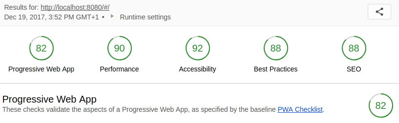
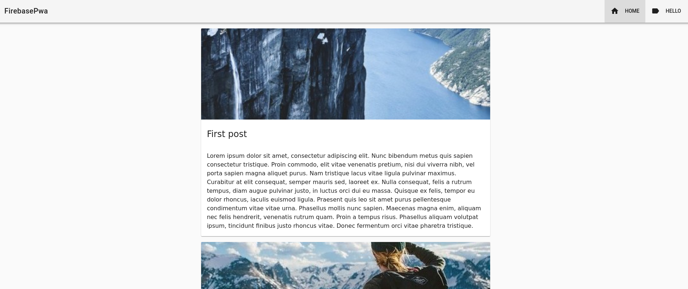
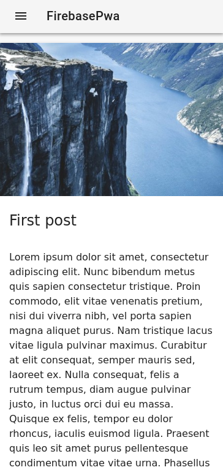
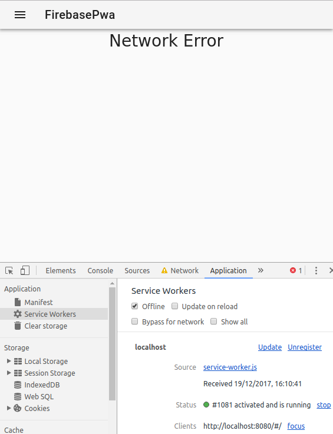

# firebase-pwa

> A Vue.js project

## Screenshots

### Lighthouse initial score
[complete report here](docs/Lighthouse%20Report.pdf)



### Desktop preview


### Mobile preview


### Offline initial message



## Todo

- [x] Get posts from Firebase
- [x] Cache static assets and skeleton app
- [ ] Cache posts
- [ ] Migration to Workbox
- [ ] Add HackerNews api [Hacker News readers as Progressive Web Apps](https://hnpwa.com/)

## Build Setup

``` bash
# install dependencies
npm install

# serve with hot reload at localhost:8080
npm run dev

# build for production with minification
npm run build

# build for production with minification and start local http-server
npm run build:local

# build for production and view the bundle analyzer report
npm run build --report

# run unit tests
npm run unit

# run e2e tests
npm run e2e

# run all tests
npm test
```

For detailed explanation on how things work, checkout the [guide](http://vuejs-templates.github.io/webpack/) and [docs for vue-loader](http://vuejs.github.io/vue-loader).

## Useful links
### Service Workers
- [Service Worker Lifecycle](https://developer.mozilla.org/en-US/docs/Web/API/Service_Worker_API/Using_Service_Workers)
- [A Progressive Web Application with Vue JS, Webpack & Material Design [Part 3]](https://blog.sicara.com/a-progressive-web-application-with-vue-js-webpack-material-design-part-3-service-workers-offline-ed3184264fd1)
- [Share Message with Application](https://css-tricks.com/making-web-app-work-offline-part-2-implementation/)
- [One Way, Two Way, Broadcast Message](https://dbwriteups.wordpress.com/2015/11/16/service-workers-part-3-communication-between-sw-and-pages/)
- [https://hnpwa.com/](https://hnpwa.com/)

#### ...to consider
- [Use Service Worker inside ](https://github.com/vuejs-templates/pwa/issues/81)
- [Messages](http://craig-russell.co.uk/2016/01/29/service-worker-messaging.html#.Wjz_V1XiaUk)
- [Workbox](https://developers.google.com/web/tools/workbox/get-started/webpack)

### VuePlugin

- [How to Create One](https://vuejsdevelopers.com/2017/04/22/vue-js-libraries-plugins/)
- [How to Create One: another link](https://alligator.io/vuejs/creating-custom-plugins/)
